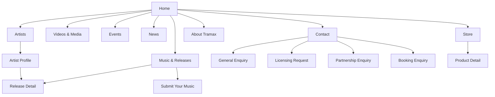
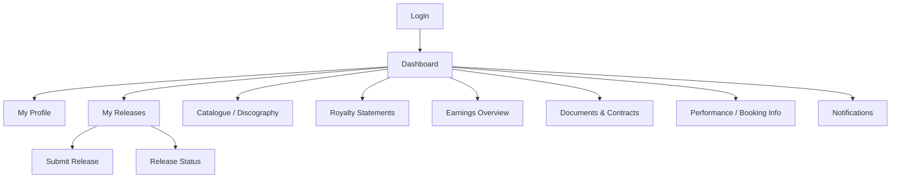
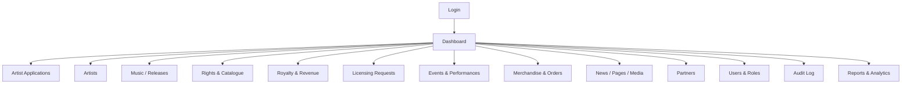
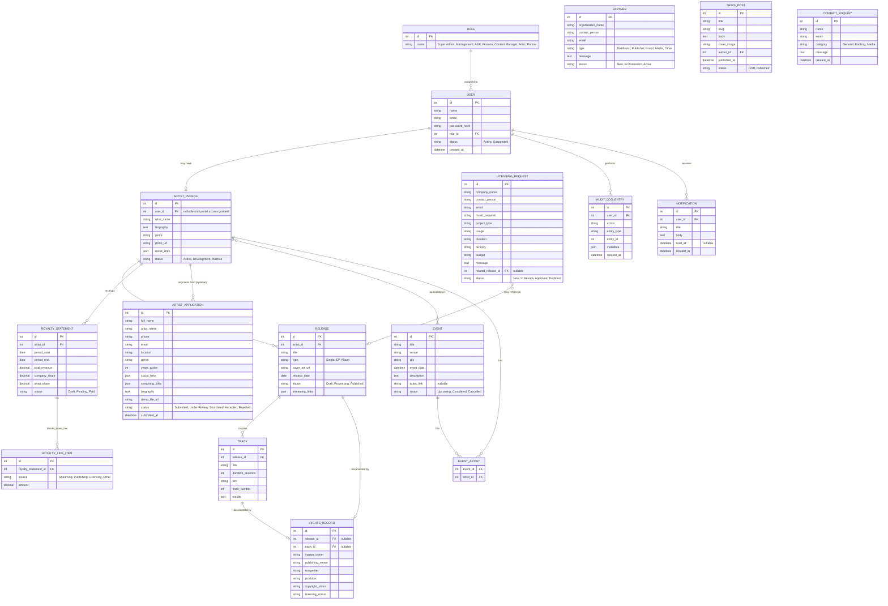

# Tramax Platform — Phase 1 Discovery

**Purpose:** the sitemap, entity model, RBAC mapping and API contract outline required to close [Phase 1 — Discovery & Planning](README.md#phase-1--discovery--planning-10) and unblock Phase 2 (UI/UX Design) and Phase 4 (Backend & Platform). Per the roadmap's Definition of Done for this phase, this document is what Tramax signs off on before design and backend work begin.

Every entity, role and endpoint below is scoped at the depth the proposal itself specifies (§4.3, §5) — **records and workflow**, not automation or calculation engines. Nothing here introduces a feature beyond what [README.md](README.md) already scoped.

---

## 1. Sitemap

### 1.1 Public Website

### 1.2 Artist Portal (authenticated)

### 1.3 Administration Platform (authenticated, role-gated)

---

## 2. Entity Model

Scoped to the ten §5 modules plus the account/audit layer every module depends on. Field lists are illustrative, not exhaustive — final columns are refined during Phase 4 migration work.

---

## 3. RBAC Matrix

Access level per module, mapped to the seven roles defined in the proposal §6. `Full` = create/read/update/delete + status changes. `Manage` = create/read/update, no destructive delete. `Read` = view only. `Own` = same rights as `Manage`/`Read` but scoped to records the user owns. `—` = no access.

| Module | Super Admin | Management | A&R / Artist Manager | Finance | Content Manager | Artist | Partner/External |
|---|---|---|---|---|---|---|---|
| Artist Management & Applications | Full | Read | Manage | — | — | Own (profile) | — |
| Music Catalogue / Releases | Full | Read | Manage | — | Read | Own (submit/track) | — |
| Distribution status | Full | Read | Manage | — | — | Own (read) | — |
| Rights Management | Full | Read | Manage | Read | — | Own (read) | — |
| Royalty Management | Full | Read | Read | Manage | — | Own (read) | — |
| Licensing Requests | Full | Read | Read | Read | — | — | Own (submit/read) |
| Events & Bookings | Full | Read | Manage | — | Read | Own (read/submit info) | — |
| Content Management (news/pages/media) | Full | Read | — | — | Manage | — | — |
| Partnerships | Full | Read | — | — | — | — | Own (submit/read) |
| Analytics & Reports | Full | Read | Read (own scope) | Read (own scope) | — | — | — |
| User Roles & Permissions | Full | — | — | — | — | — | — |
| Audit Log | Full | Read | — | — | — | — | — |

This matrix is the source of truth for RBAC middleware rules built in Phase 4 — no module ships with broader access than stated here without a documented change to this table.

---

## 4. API Contract Outline

REST-style, versioned under `/api/v1`. Auth via role-based session/token per the proposal's §8 recommendation. Endpoints are grouped by consumer; write endpoints on the admin/artist-portal groups are RBAC-checked against the matrix above.

### 4.1 Public site (unauthenticated, read + form submission only)

| Method | Endpoint | Purpose |
|---|---|---|
| GET | `/api/v1/artists` | Artist directory listing |
| GET | `/api/v1/artists/{slug}` | Artist profile detail |
| GET | `/api/v1/releases` | Music catalogue listing (filter by type/artist) |
| GET | `/api/v1/releases/{slug}` | Release detail incl. streaming/social links |
| GET | `/api/v1/videos` | Video/media gallery listing |
| GET | `/api/v1/events` | Events listing |
| GET | `/api/v1/events/{slug}` | Event detail |
| GET | `/api/v1/news` | News/blog listing |
| GET | `/api/v1/news/{slug}` | News post detail |
| GET | `/api/v1/products` | Store/merchandise listing *(conditional — catalogue only unless checkout confirmed in scope)* |
| POST | `/api/v1/applications` | Artist submission / talent application form |
| POST | `/api/v1/licensing-requests` | Music licensing & commercial-use request form |
| POST | `/api/v1/partners` | Partnership and business enquiry form |
| POST | `/api/v1/contact` | General contact form, routed by `category` |

### 4.2 Artist portal (authenticated as Artist role)

| Method | Endpoint | Purpose |
|---|---|---|
| POST | `/api/v1/auth/login` / `/logout` | Artist authentication |
| GET / PATCH | `/api/v1/me/profile` | View/update own artist profile |
| GET | `/api/v1/me/releases` | List own releases |
| POST | `/api/v1/me/releases` | Submit new release |
| GET | `/api/v1/me/releases/{id}` | Release status detail |
| GET | `/api/v1/me/catalogue` | Discography view |
| GET | `/api/v1/me/royalty-statements` | List own royalty statements |
| GET | `/api/v1/me/royalty-statements/{id}` | Statement detail |
| GET | `/api/v1/me/earnings-summary` | Earnings overview |
| GET | `/api/v1/me/documents` | Documents/contracts *(where enabled)* |
| GET | `/api/v1/me/bookings` | Performance/booking info |
| GET | `/api/v1/me/notifications` | Notifications feed |

### 4.3 Admin platform (authenticated, RBAC-checked per §3 matrix)

| Method | Endpoint | Purpose |
|---|---|---|
| GET | `/api/v1/admin/dashboard` | Operational summary |
| GET / PATCH | `/api/v1/admin/applications` / `/{id}` | Application queue + status transitions |
| CRUD | `/api/v1/admin/artists` | Artist records |
| CRUD | `/api/v1/admin/releases`, `/tracks` | Release/track management |
| CRUD | `/api/v1/admin/rights-records` | Rights & catalogue records |
| CRUD | `/api/v1/admin/royalty-statements`, `/royalty-line-items` | Royalty records |
| GET / PATCH | `/api/v1/admin/licensing-requests` / `/{id}` | Licensing queue + status |
| CRUD | `/api/v1/admin/events`, `/event-artists` | Events & participation |
| CRUD | `/api/v1/admin/products`, `/orders` | Store/order management *(conditional)* |
| CRUD | `/api/v1/admin/news`, `/pages`, `/media` | Content management |
| CRUD | `/api/v1/admin/partners` | Partner records |
| CRUD | `/api/v1/admin/users`, `/roles` | User & role administration |
| GET | `/api/v1/admin/audit-log` | Audit trail (read-only) |
| GET | `/api/v1/admin/reports/*` | Analytics & reporting endpoints |

---

## 5. MVP Depth Confirmation

Restating the roadmap's Phase 1 gate explicitly, per module, for sign-off:

| Module | MVP depth (this build) | Explicitly excluded from MVP |
|---|---|---|
| Distribution | Status/workflow tracking + platform links | Live DSP delivery/API integration |
| Royalty Management | Manually entered records, statements, shares | Automated calculation engine, automated DSP revenue ingestion |
| Rights Management | Ownership record-keeping | Contract automation |
| Store | Product listing | Checkout/payment *(unless confirmed separately)* |
| Licensing | Inbound request intake + status | Automated licensing/contract generation |

---

## 6. Environment & Delivery Strategy

- **Environments:** `dev` (feature branches) → `staging` (UAT, mirrors production config) → `production`.
- **Branching:** trunk-based with short-lived feature branches per module (aligns with Phase 4's per-module parallelization); `main` always deployable to staging.
- **CI:** run lint + automated tests on every push; block merge to `main` on failure.
- **Secrets:** environment-specific `.env` per environment, never committed; managed hosting/VPS credentials issued in Phase 0.
- **Testing:** see [README.md §13](README.md#13-testing--quality-strategy) for the full test strategy — this document supplies the module/role scope that strategy tests against.

---

*Once reviewed, this document closes Phase 1's Definition of Done: sitemap, entity model and MVP depth confirmed in writing. Phase 2 (UI/UX Design) and Phase 4 schema work build directly from the sections above.*
